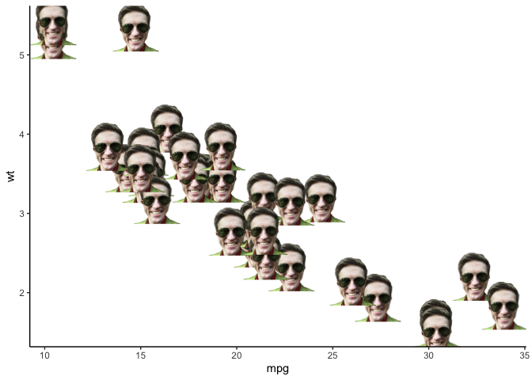
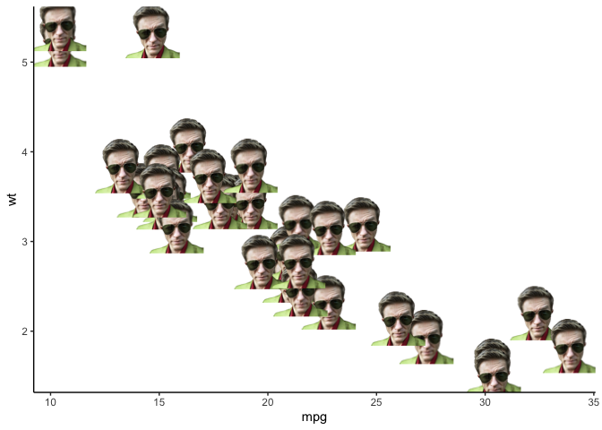
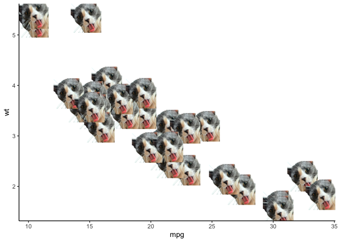

<!-- README.md is generated from README.Rmd. Please edit that file -->

# ggstephen

<!-- badges: start -->
<!-- badges: end -->

The goal of ggstephen is to provide additional geoms for ggplot2 plots.

## Installation

You can install the development version of ggstephen like so:

``` r
remotes::install_github("stephenturner/ggstephen")
```

## Example

This is a basic example which shows you how plot data `geom_stephen()`.
Additional examples show alternate geoms. For help see `?geom_stephen`.

``` r
library(ggplot2)
library(ggstephen)
theme_set(theme_classic())
```

``` r
# The default geom is "stephen1"
ggplot(mtcars) + geom_stephen(aes(mpg, wt))
```



``` r

# Alternate geom
ggplot(mtcars) + geom_stephen(aes(mpg, wt), stephen = "stephen2")
```



``` r

# Stephen's cat "pancake"
ggplot(mtcars) + geom_stephen(aes(mpg, wt), stephen = "cat")
```


